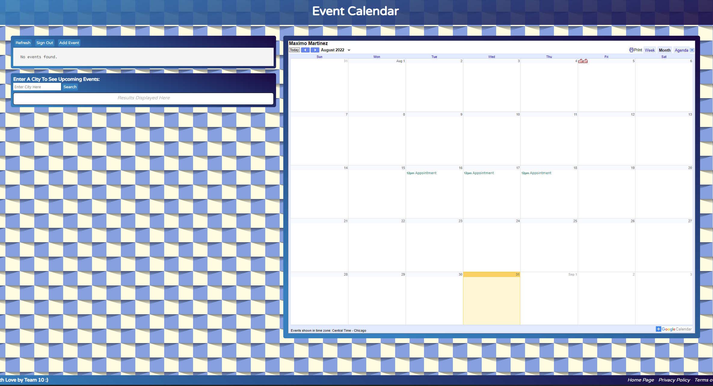

# Project-1
## Title: Happenstance

# User story:
 As a user, I want to search events in the area, So that I can add them to my google calendar.

# Description:
When I open the application,
Then a search bar appears,
When the user types in input,
Then the users can search events,
When the user finds an event,
Then they can add it to their google Calendar,
When the user exits the site,
Then the user data will be saved.

# Technologies Used:
Google Calendar
Eventbrite

# Screenshot: 

# Deployed Application:
[https://maximtz13.github.io/Happenstance/](https://maximtz13.github.io/Happenstance/)
